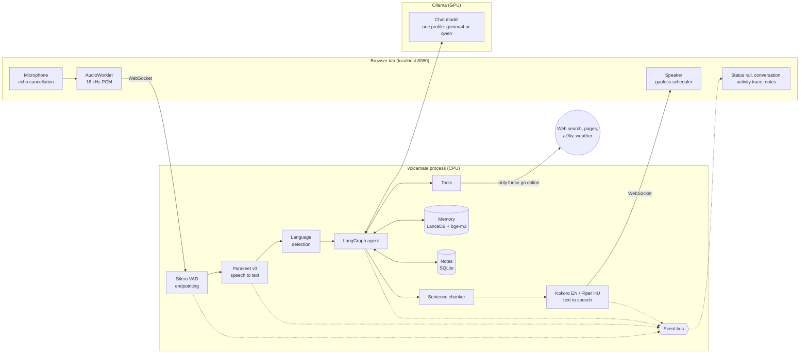
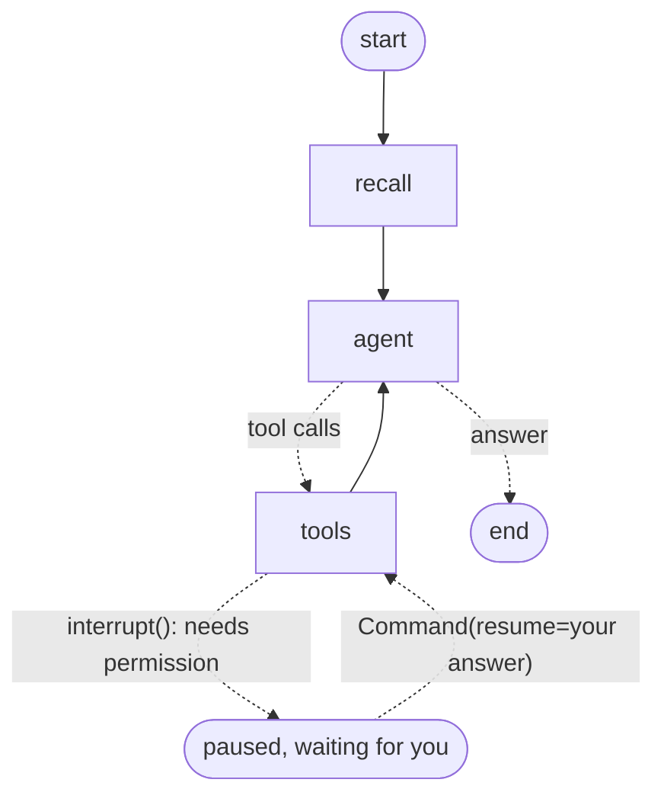
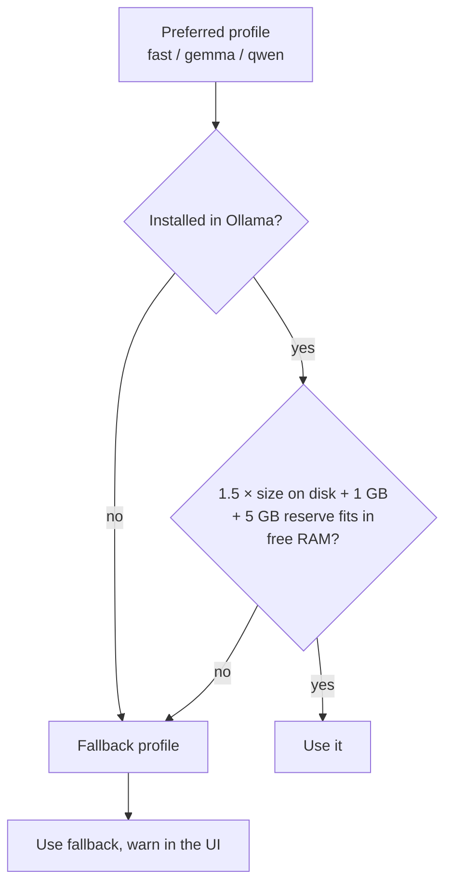
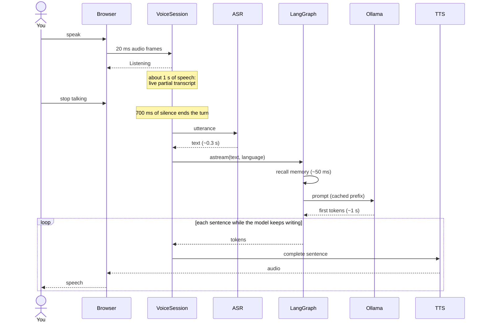
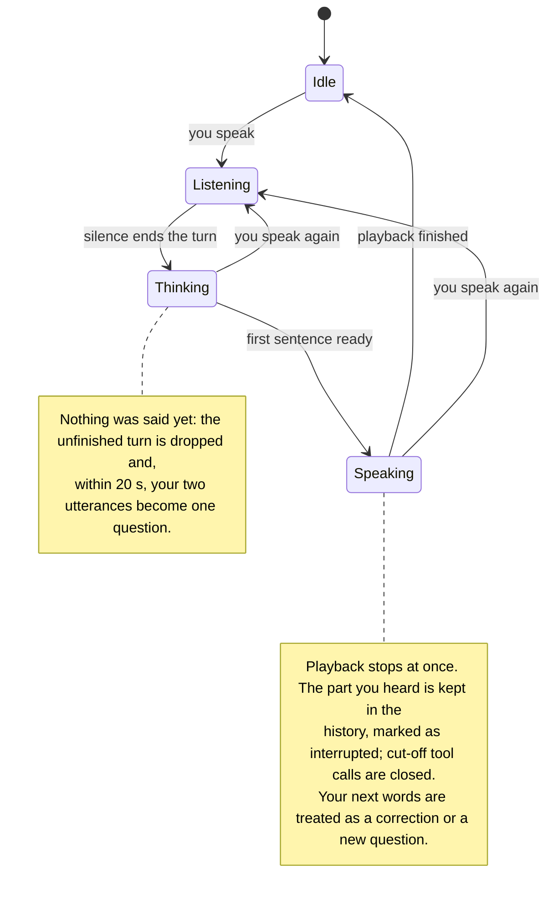
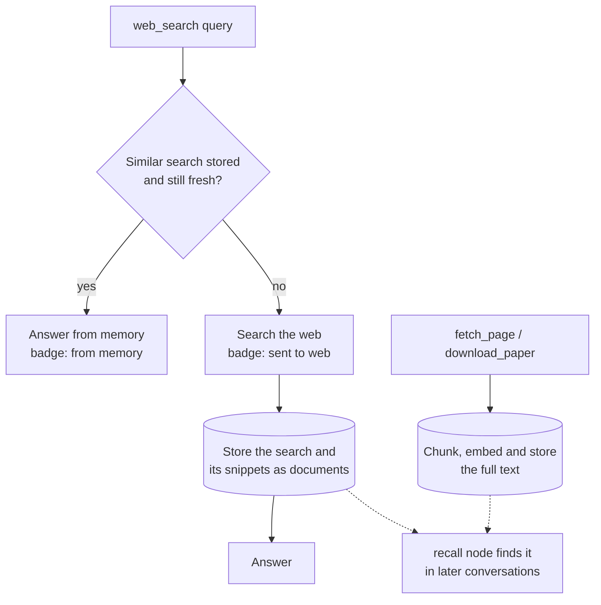

# How it works

voicemate is a pipeline of small local models around one LangGraph agent. Everything runs
in one Python process except the language model, which runs in Ollama.

## The whole system



The speech models run on the CPU on purpose: the GPU and most of the memory belong to the
language model (see the spec, §10).

## The LangGraph agent

This diagram is generated from the compiled graph (`graph.get_graph().draw_mermaid()`):



- **recall** embeds what you said and loads relevant facts, earlier conversations and
  research into a per-turn context block (about 50 ms).
- **agent** calls the model with every tool bound. The system prompt never changes, so
  Ollama reuses its cached prompt; only the newest message carries the context.
- **tools** runs the requested tools. Errors go back to the model as text, so it can retry
  or explain. After 6 tool rounds the tools are removed and the model must answer.
- A **checkpointer** (SQLite) keeps the conversation, including interrupted answers and
  paused runs. The current thread id lives in `data/conversation.json`, so a reloaded page
  or a restarted server continues where you left off; **New conversation** starts a new one.
- If the model goes silent after a tool round, the agent asks it once more to answer.

## Asking before risky actions (human-in-the-loop)

```mermaid
sequenceDiagram
    actor You
    participant S as VoiceSession
    participant G as LangGraph
    participant T as write_file tool

    You->>S: "Save my notes to plan.md"
    S->>G: run
    G->>T: write_file(plan.md)
    T->>T: file exists
    T-->>G: interrupt("plan.md already exists. Replace it?")
    G-->>S: run paused (checkpointed)
    S-->>You: dialog + spoken question
    You->>S: "no, call it plan2" (voice, typing or a button)
    S->>G: Command(resume="no, call it plan2")
    G->>T: answer is not a yes → nothing replaced
    T-->>G: "The user did not approve; they said: no, call it plan2"
    G->>G: model writes plan2.md instead
```

The tool receives your exact words, so a "no, but…" can redirect the action. The pause
survives page reloads because it lives in the checkpointer.

## Choosing the model



A model that does not fit gets paged out by macOS between turns; replies then take 15+ s
instead of about 1 s. Each profile is one model used for everything.

## One spoken turn



The first sentence is spoken while the model is still writing the rest. A network tool
(search, weather) adds a short spoken filler ("One moment, let me check.").

## Talking while it works



**Hold until I'm finished.** The Hold button (Ctrl+H) stops a running answer and suspends
endpointing: each pause still produces a transcript, but it is collected rather than
answered. **I'm finished**, or turning the microphone off, sends everything as one
question. Turning the microphone off without a hold also answers what was heard so far,
including a sentence cut off mid-word.

While it speaks, barge-in needs louder and longer speech (`vad.barge_in_*`), so its own
voice from the speakers does not interrupt it.

## Research memory



Freshness depends on the topic: news and jobs expire after a day, general pages after 30
days, papers after a year.
